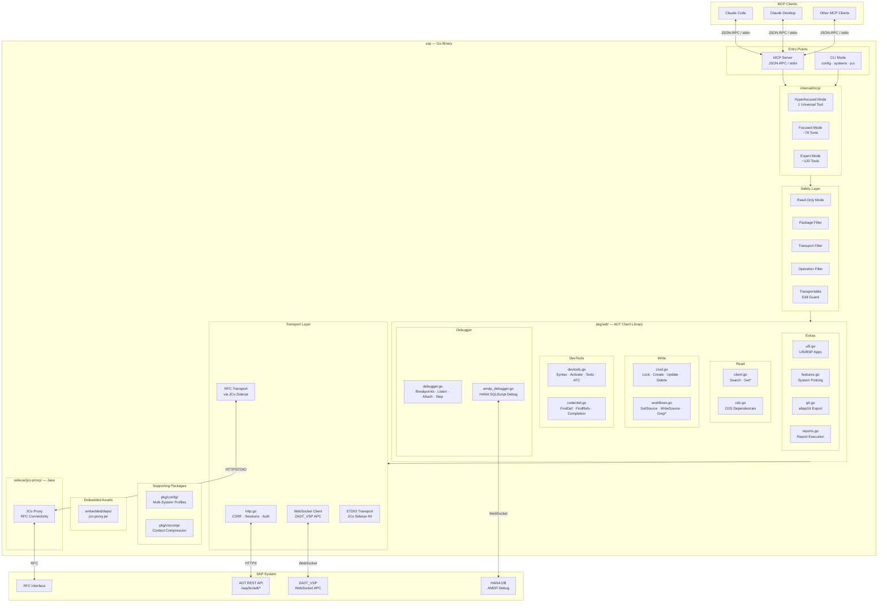
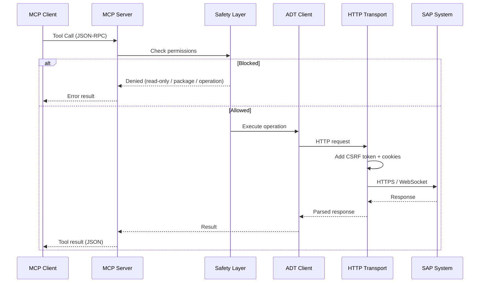
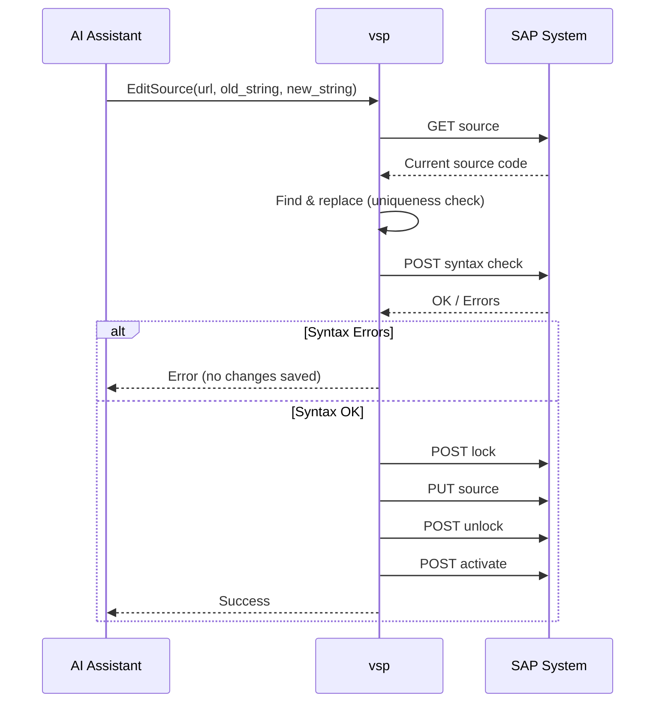
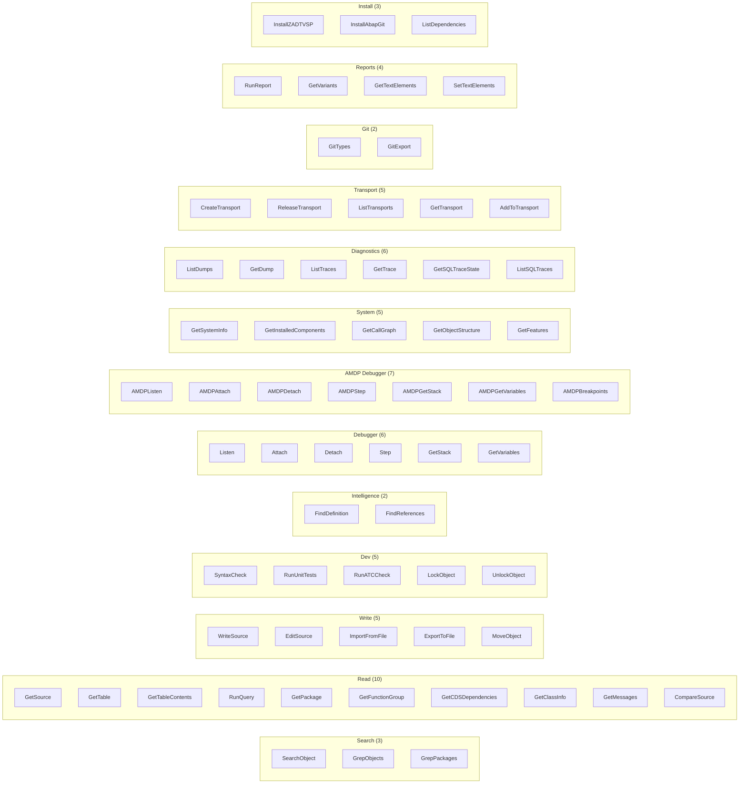
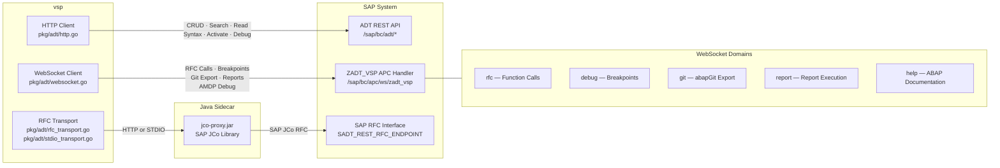
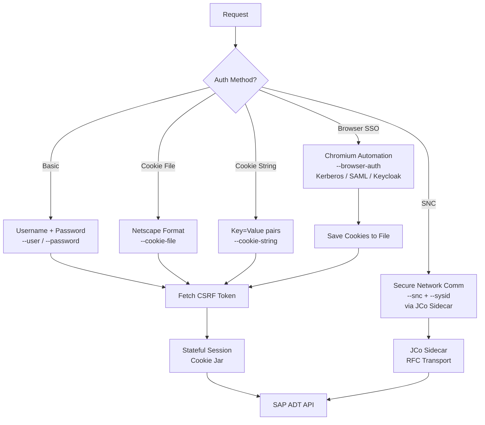
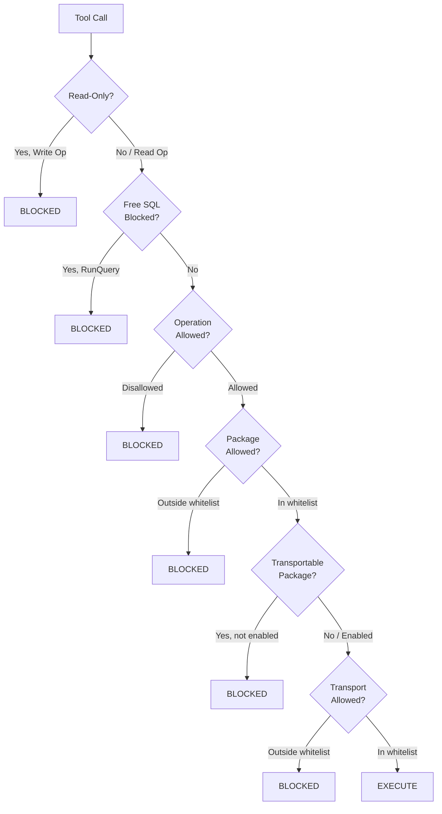

# vsp Architecture

> **Note**: This is the enterprise fork of [Vibing Steampunk](https://github.com/oisee/vibing-steampunk).
> This architecture document describes the current state after refactoring for multi-system support and enterprise readiness.
> See [FORK.md](../FORK.md) for details on changes from the original project.

## High-Level Architecture



## Request Flow



## Write Operation Flow (EditSource)



## Tool Categories

Focused mode exposes ~79 essential tools. Expert mode adds ~40 more granular/legacy tools (~120 total).
Hyperfocused mode collapses everything into 1 universal SAP tool.
Tool groups can be individually disabled via `--disabled-groups` flags or `.vsp.json` config.



## Triple Transport: HTTP + WebSocket + RFC



## Package Structure

```
vibing-steampunk/
├── cmd/vsp/                    # CLI entry point (cobra/viper)
│   ├── main.go                 #   Flags, env vars, auth, MCP server startup
│   ├── cli.go                  #   Multi-system profile management
│   ├── config_cmd.go           #   config init/show/mcp-to-vsp/tools subcommands
│   └── jco.go                  #   JCo sidecar setup/status commands
│
├── internal/mcp/               # MCP protocol layer (32 files)
│   ├── server.go               #   MCP server core, client init, multi-system
│   ├── tools_register.go       #   Mode-aware tool registration (~120 tools)
│   ├── tools_focused.go        #   Focused mode whitelist (~79 tools)
│   ├── tools_groups.go         #   Disableable tool groups (U/T/H/D/C/G/R/X)
│   ├── tools_aliases.go        #   Short alias names (gs→GetSource, etc.)
│   ├── multi_system.go         #   Multi-system connection management
│   └── handlers_*.go           #   Per-domain tool handlers (20+ files)
│
├── pkg/adt/                    # ADT client library (core, ~54 files)
│   ├── client.go               #   Read operations + search
│   ├── crud.go                 #   Lock / create / update / delete
│   ├── devtools.go             #   Syntax check, activate, unit tests, ATC
│   ├── codeintel.go            #   Find definition, references, completion
│   ├── workflows.go            #   High-level: GetSource, WriteSource, Grep*
│   ├── debugger.go             #   External ABAP debugger (HTTP + WebSocket)
│   ├── amdp_debugger.go        #   HANA/AMDP SQLScript debugger
│   ├── ui5.go                  #   UI5/Fiori BSP management
│   ├── cds.go                  #   CDS view dependency analysis
│   ├── git.go                  #   abapGit export via WebSocket
│   ├── reports.go              #   Report execution, variants, spool output
│   ├── safety.go               #   Read-only, package/op filtering
│   ├── features.go             #   System capability detection
│   ├── http.go                 #   HTTP transport (CSRF, sessions, auth)
│   ├── transport.go            #   Transport interface abstraction
│   ├── rfc_transport.go        #   RFC proxy transport (via JCo sidecar HTTP)
│   ├── stdio_transport.go      #   RFC proxy transport (via JCo sidecar STDIO)
│   ├── sidecar.go              #   JCo sidecar process lifecycle management
│   ├── jco_discovery.go        #   JCo library detection (platform-specific)
│   ├── browser_auth.go         #   Browser-based SSO (Kerberos/SAML/Keycloak)
│   ├── landscape.go            #   SAP UI Landscape XML parsing (SNC/SSO)
│   ├── recorder.go             #   Execution recording for time-travel debug
│   ├── history.go              #   Tool call history tracking
│   ├── websocket.go            #   WebSocket client (ZADT_VSP APC)
│   ├── websocket_base.go       #   WebSocket base types
│   ├── websocket_types.go      #   WebSocket protocol types
│   ├── websocket_rfc.go        #   RFC-over-WebSocket operations
│   ├── websocket_debug.go      #   Debug-over-WebSocket operations
│   ├── xml.go                  #   ADT XML type definitions
│   └── config.go               #   Client configuration with functional options
│
├── pkg/config/                 # Multi-system configuration
│   └── systems.go              #   .vsp.json profile management, granular tool config
│
├── pkg/ctxcomp/                # Context compression
│   └── *.go                    #   Dependency analysis, contract extraction for AI
│
├── sidecar/jco-proxy/          # Java JCo proxy (Maven project)
│   ├── pom.xml                 #   Maven build (SAP JCo dependency)
│   └── src/main/               #   Java source: RFC↔HTTP/STDIO bridge
│
├── embedded/                   # Assets embedded in Go binary
│   └── deps/                   #   jco-proxy.jar (compiled sidecar)
│
├── abap/                       # ABAP source artifacts
│   └── src/                    #   ZADT_VSP and related ABAP objects
│
└── docs/                       # Documentation
    ├── architecture.md         #   This file
    ├── DSL.md                  #   DSL reference
    └── adr/                    #   Architecture Decision Records
```

## Authentication



## Safety System



## Testing

312 unit test functions across 34 test files. No SAP system required — all unit tests use mock HTTP transports.

```
go test ./...                                    # All unit tests
go test -tags=integration ./pkg/adt/             # Integration tests (requires SAP)
```

## Design Decisions

1. **Single Binary**: No runtime dependencies (except optional JCo sidecar for RFC mode)
2. **Functional Options**: Flexible client configuration via `adt.WithXxx()` pattern
3. **Stateful HTTP**: Required for CRUD operations (lock handles, CSRF tokens, session cookies)
4. **Triple Transport**: HTTP for ADT REST, WebSocket for ZADT_VSP APC, RFC via JCo sidecar
5. **Mode-Aware Tools**: Focused (default), Expert (all), Hyperfocused (single universal tool)
6. **Granular Tool Control**: Groups can be disabled (`--disabled-groups`), individual tools via `.vsp.json`
7. **Multi-System**: Connect to multiple SAP systems from one instance via profiles
8. **Safety by Default**: Read-only mode, package/transport whitelists, operation filtering
9. **Java Sidecar**: Embedded `jco-proxy.jar` for RFC connectivity without CGo

## Build Targets

Cross-compilation via Makefile and GoReleaser:

| OS | Architectures |
|----|---------------|
| Linux | amd64, arm64, 386, arm |
| macOS | amd64, arm64 (Apple Silicon) |
| Windows | amd64, arm64, 386 |

```
make build          # Current platform
make build-all      # Common targets (linux-amd64, darwin-arm64, windows-amd64)
make build-all-all  # All 9 targets
```
